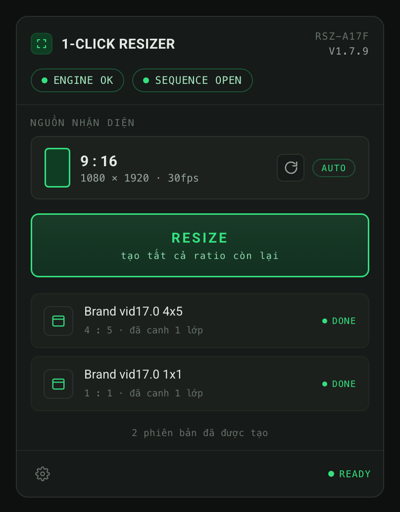

<h1 align="center">1-Click Resizer</h1>

<b>Premiere Pro panel — resize a sequence to 9:16 / 4:5 / 1:1 in one click.</b> 
<i>Panel cho Premiere Pro — resize sequence sang 9:16 / 4:5 / 1:1 chỉ với một cú click.</i>

  

  
  

  <a href="https://github.com/tungnguyen1202/1-click-resizer/releases/latest/download/1-Click-Resizer-Installer.zip"><b>⬇️ Download installer (.zip)</b></a>
  &nbsp;·&nbsp;
  <a href="#-tiếng-việt">🇻🇳 Tiếng Việt</a>
  &nbsp;·&nbsp;
  <a href="#-english">🇬🇧 English</a>

---

## 🇬🇧 English

**Click a sequence in the Project panel** (no need to open it) and press **RESIZE** — the panel turns it into the other two ratios of **{9:16, 4:5, 1:1}** as new sequences: duplicating, resizing the frame, renaming, filling the background, and keeping text/graphics inside the Reels safe zone. Your original sequence and audio are never touched.

**What one click does**
- **Duplicate** the active sequence (original untouched).
- **Frame size** → target (1080-wide: 9:16 = 1080×1920, 4:5 = 1080×1350, 1:1 = 1080×1080); frame rate preserved.
- **Rename** — swaps the trailing ratio label, e.g. `Clip 9-16` → `Clip 4-5`.
- **Background fill** — background-track clips scale to cover a taller frame.
- **Reels safe zone** — when the target is 9:16, overlays are pulled inside a configurable safe band.
- **Realtime** source detection (AUTO) and **in-panel auto-update** (a bar appears when a new version is out — one click to update).

**Install (macOS, no Terminal)**
1. [Download the installer .zip](https://github.com/tungnguyen1202/1-click-resizer/releases/latest/download/1-Click-Resizer-Installer.zip)
2. Unzip → **right-click** “Cài đặt 1-Click Resizer” → **Open** → **Open** *(first launch only — the app is unsigned)*
3. Quit Premiere fully (Cmd+Q), reopen → **Window → Extensions → 1-Click Resizer**

From then on the panel updates itself — you never reinstall.

---

## 🇻🇳 Tiếng Việt

**Click chọn một sequence ở Project panel** (không cần mở) rồi bấm **RESIZE** — panel biến nó thành hai ratio còn lại trong **{9:16, 4:5, 1:1}** dưới dạng sequence mới: tự duplicate, đổi khung, đặt tên, fill nền và giữ text/graphic trong vùng an toàn (safe zone) của Reels. **Sequence gốc và audio không bao giờ bị đụng tới.**

**Một cú click làm gì**
- **Duplicate** sequence đang mở (giữ nguyên bản gốc).
- **Đổi khung** → ratio đích (rộng 1080: 9:16 = 1080×1920, 4:5 = 1080×1350, 1:1 = 1080×1080); giữ nguyên frame rate.
- **Đổi tên** — thay nhãn ratio ở cuối, vd `Clip 9-16` → `Clip 4-5`.
- **Fill nền** — clip ở track nền tự phóng to để phủ kín khung cao hơn.
- **Safe zone Reels** — khi resize về 9:16, text/graphic lệch ra ngoài được kéo vào dải an toàn (chỉnh được).
- **Nhận diện realtime** (AUTO) và **tự cập nhật trong panel** (có bản mới là hiện thanh báo — bấm một nút là xong).

**Cài đặt (macOS, không cần Terminal)**
1. [Tải bộ cài .zip](https://github.com/tungnguyen1202/1-click-resizer/releases/latest/download/1-Click-Resizer-Installer.zip)
2. Giải nén → **chuột phải** vào “Cài đặt 1-Click Resizer” → **Open** → **Open** *(chỉ lần đầu — app chưa ký nên macOS cảnh báo)*
3. Thoát hẳn Premiere (Cmd+Q), mở lại → **Window → Extensions → 1-Click Resizer**

Từ đó panel tự cập nhật — không bao giờ phải cài lại.

---

Chi tiết kỹ thuật, Settings, giới hạn & hướng dẫn cho maintainer: xem <a href="com.oneclickresize.panel/README.md">tài liệu đầy đủ</a>.

